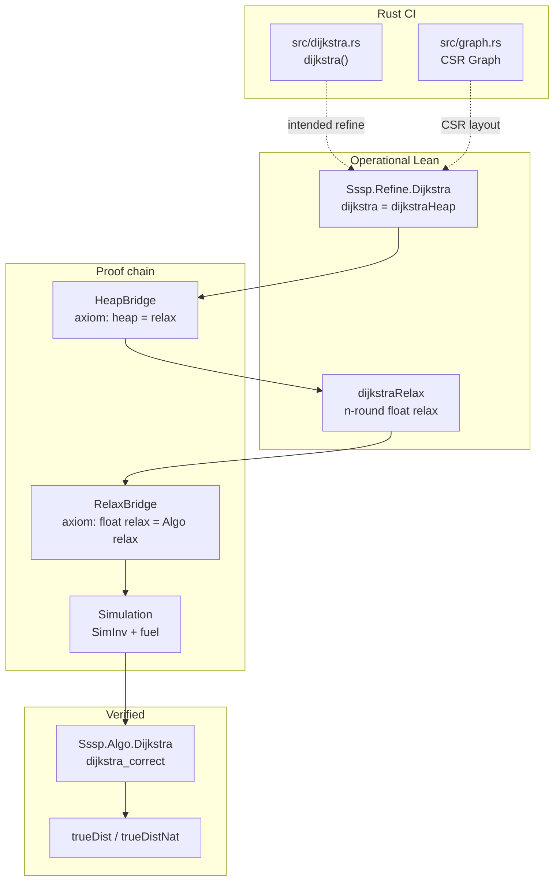

# Dijkstra verification stack

This document maps the **full verification path** from Rust executable code to
the verified `Sssp.Algo` algorithm. Phase 3b closed the main functional theorem;
this is the roadmap to **zero trusted axioms** and a **Rust refinement proof**.
For the complete current trusted surface, see [`AXIOMS.md`](./AXIOMS.md).

## Layer diagram



## Theorems (current)

| Statement | Module | Status |
|-----------|--------|--------|
| `Algo.dijkstra G s v = trueDist G s v` | `Sssp.Algo.Dijkstra` | **Proved** |
| `dijkstraRelax … = nnrealToFloat (Algo.dijkstra …)` | `Simulation` | **Proved** (via RelaxBridge axioms) |
| `refine_dijkstraRelax_correct` | `RefineCorrectness` | **Proved** |
| `refine_dijkstra_correct` (heap) | `RefineCorrectness` | **Proved** (via HeapBridge axiom) |
| `dijkstraHeap = dijkstraRelax` | `HeapBridge` | **Axiom** + fixture `native_decide` |
| Rust `dijkstra` refines `Refine.dijkstra` | — | **Not started** |

Main unconditional theorem:

```lean
theorem refine_dijkstra_correct (vg : ValidRustGraph n g) (s v : Fin n) :
  (dijkstra g s.val)[v.val]! = withTopNatToFloat (trueDistNat vg.toGraph s v)
```

## Trusted Axioms (Elimination Order)

The current theorem stack is intentionally explicit about what remains trusted.
Work in this order; each step unlocks the next. `AXIOMS.md` is the canonical
inventory, while this section explains how those assumptions fit into the
Dijkstra refinement proof.

### 1. Numeric bridge (`Sssp.Refine.NumericBridge`)

| Axiom | Replacement strategy |
|-------|---------------------|
| `floatWeight_add`, `floatWeight_lt_iff`, `floatWeight_le_iff` | Peano induction + IEEE lemmas, or restrict to `Float.ofNat` |
| `floatWeight_eq_ofNat` | Link Peano `floatWeight` to `Float.ofNat` |
| `nnrealToFloat_add_weight` | Prove for `.some` nat casts; `⊤` case separate |
| `nnrealToFloat_monotone`, `nnrealToFloat_trueDist_add` | From `Sound` + path lemmas |

**Proved this session:** `nnrealToFloat_add_weight_ofNat`.

### 2. CSR relax alignment (`Sssp.Refine.RelaxBridge`)

| Item | Status |
|------|--------|
| `floatRelaxEdge_aligned_ne` (x ≠ target) | **Proved** |
| `floatRelaxEdge_aligned_v` (target vertex) | **Proved** via numeric bridge assumptions |
| `floatRelaxEdge_aligned` | **Proved** |
| `floatRelaxOut_aligned` | **Proved modulo** `relaxOutEdges_eq_relaxCsrOut` |
| `relaxOutEdges_eq_relaxCsrOut` | **Axiom** — CSR order vs `Graph.outEdges` order |
| `foldl_range_floatRelaxAll_aligned` | **Axiom** — induction over `List.range` still pending |

Length lemmas are already proved.

### 3. Graph bridge (`Sssp.Refine.GraphBridge`)

| Axiom | Replacement strategy |
|-------|---------------------|
| `outEdge_floatWeight_preimage` | Lemma: `fromEdgeList` stores `floatWeight w`; link `outEdges` index to edge list entry |

Fixture `ValidRustGraph` instances are **proved** (no axioms).

### 4. Heap simulation (`Sssp.Refine.HeapBridge`)

| Axiom | Replacement strategy |
|-------|---------------------|
| `dijkstraHeap_eq_dijkstraRelax` | `dijkstraRun` invariants: soundness + completeness on nat weights, out-degree ≤ 2 |

Model matches `src/dijkstra.rs`: lazy min-heap, stale-entry skip, same relax condition.

### 5. Rust refinement (`src/dijkstra.rs`)

Hand proof or (future) Lean export that:

- `Graph` CSR layout matches `RustGraph.fromEdgeList`
- Loop body matches `dijkstraStep` / `dijkstraRun`
- `f64::INFINITY` = `distInf`, integer weights = `floatWeight w`

## Regression harness

```bash
cd formal/lean && lake build
./formal/scripts/check-fixtures.sh   # Lean #guard + Rust JSON fixtures
cargo test shared_json_fixtures
```

Fixtures prove **operational agreement**; they do not replace proof obligations above.

## Next milestone

**Phase 3c:** eliminate RelaxBridge axioms (items 1–2 above), then heap simulation (item 4).
Phase 4 (`DStruct`, …) stays blocked until Phase 3c axioms are gone or explicitly deferred.
